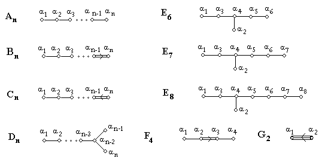

# Extending Snow's algorithm (ESA)

In 1990, D. Snow proposed an effective algorithm for computing the orbits of finite
Weyl groups. Snow’s algorithm is designed for computation of weights, $W$-orbits, and
elements of the Weyl group.

Here, the Python implementation of Extended Snow's Algorithm (ESA) is proposed.
ESA allows to find pairs of mutually inverse elements together with the calculation of $W$-orbits in the same runtime cycle.
For the detail explanation of this algorithm, see 
* [Extending Snow's Algorithm](https://link.springer.com/epdf/10.1186/s13663-023-00755-w)

* [Snow’s algorithm](https://dl.acm.org/doi/abs/10.1145/77626.77634) produces the weights 
of W-orbits and elements of the Weyl group by levels. Let $l(w)$ is the smallest length of $w$ given as reduced expression. 
Following Snow,  the **level** of the element $w$ is $l(w)$.

Section 

* [D4_levels](https://github.com/Rafael1s/Weyl-Group-Algorithms/tree/main/Extended_Snow_Algorithm/D4_Levels)
contains the output example for the Weyl group $W(D_4)$. 
We follow Bourbaki's numbering for vertices and simple roots in root systems and Dynkin diagrams.

Extending Snow's algorithm should simplify the calculation of conjugacy classes in the Weyl group,
see section  

* [Get Conjugacy Classes](https://github.com/Rafael1s/Weyl-Group-Algorithms/tree/main/Get_Conjugacy_Classes)

