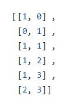

# Some tools for Root systems  

* File __exc_root_list.py__ contains 5 lists of positive roots for exceptional root systems:
  E6, E7, E8, F4, G2.  The function __getExceptRootList(diagram, n)__ returns the corresponding root list
  The parameter __diagram__ can be one from 3 characters {'E', 'F', 'G'}, and the parameter __n__ takes values
  6, 7, 8 for the case 'E'.  For cases 'F', 'G' __n__ should be any positive integer number, doesn't matter what.
  The output list is the list of positive roots ordered in the __regular ordereing__. Acoocrding the
  regular ordereng roots are ordred by height. In the case of the same height they are ordered in the lexicographical
  ordering. For example, for **G2** the output root list is as follows:
  

   For **F4** the output root list contains **24** roots.
   For **E6** (resp, **E7**, resp. **E8**) the output root list contains **36** (resp. **63**, resp. **120** roots)

*  File __CoxeterNumber.py__ contains only one function __getCoxeterNumber(diagram, n)__.
   Here, diagram is one from 7 characters: {'A', 'B', 'C', 'D', E', 'F', 'G'}.  The paramter __n__ should be only
   for diagram 'E', n = 6,7,8. This function returns  the Coxeter number, which coincides with the height  of the
   maximal root (increased by 1) for the corresponding root system. This number is used in the file
   __PositiveRoots.py__ for arranging the loop by the height of roots.  
  
  
   
