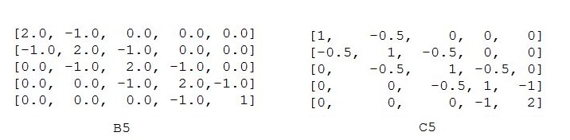

#  Root systems associated with Lie algebras

## File __exc_root_list.py__ 
  Contains 5 lists of positive roots for exceptional root systems:
  E6, E7, E8, F4, G2.  The function __getExceptRootList(diagram, n)__ returns the corresponding root list
  The parameter __diagram__ can be one from 3 characters {'E', 'F', 'G'}, and the parameter __n__ takes values
  6, 7, 8 for the case 'E'.  For cases 'F', 'G' __n__ should be any positive integer number, doesn't matter what.
  The output list is the list of positive roots ordered in the __regular ordereing__. Acoocrding the
  regular ordereng roots are ordred by height. In the case of the same height they are ordered in the lexicographical
  ordering. For example, for **G2** the output root list is as follows:
  

   For **F4** the output root list contains **24** roots.
   For **E6** (resp, **E7**, resp. **E8**) the output root list contains **36** (resp. **63**, resp. **120** roots)

##  File __CoxeterNumber.py__ 
   Contains only one function __getCoxeterNumber(diagram, n)__.
   Here, diagram is one from 7 characters: {'A', 'B', 'C', 'D', E', 'F', 'G'}.  The paramter __n__ should be only
   for diagram 'E', n = 6,7,8. This function returns  the Coxeter number, which coincides with the height  of the
   maximal root (increased by 1) for the corresponding root system. This number is used in the file
   __PositiveRoots.py__ to loop throgh he height of the roots.

##  File __BilinearForm.py__ 
   Contains the matrices of bilinear form for all types of root system. For the exceptional types
   __E, F, G__  these matrices are specified explicitly, whereas for serias types they are implicitly given, namely they are
   given by some short functions. These function for series __B, C, D__ just update a few elements of the matrix for the
   serias __A__.  For example, for series __B__ and  __C__ this function is as follows:

   

   This file provides function __getBilForm(diagram, n)__ , where parameters __diagram__ nad __n__ are as in the previous 
   paragraphs. The output of the function __getBilForm__ is the matrix of the bilinear form. For example, the matrices
   of the bilnear form for cases __B5__ and __C5__ are aa follows: 
   
   

## File MaximalRoot.py 
   Provides the maximal positive root for all cases Root Systems. The main function is
   __getMaxRoot(diagram, n)__.  Parameters __diagram__ nad __n__ are as in the previous paragraphs.

## File __PositiveRoots.py__  
  Contains  __class PositiveRoots__ which provides the list of positive roots for any class
  of root system. For exceptional root systems __E, F, G__  lists of positive roots are provided by the file __exc_root_list.py__,
  see above.  For series types __A, B, C, D__ the positive roots are obtained by some short functions. To use this class
  you need to call two lines like this:

      rs = PositiveRoots('D',12)
      list_pos_roots = rs.getRootList()

#### The number of positive roots

    G2    6               An    n(n+1)/2    
    F4   24               Bn    n^2    
    E6   36               Cn    n^2    
    E7   63               Dn    n(n-1)    
    E8  120

 ## File RootLength.py 
   Contains 2 print funcions: (1) __printRoots()__ lists all roots together with lengths, (2) __printListOfRoots_by_height__
   lists all roots by sections having the samee height.  The function __printRoots()__.  The first function calculates length
   for every root using the function __scalarProduct(root)__, which in turn uses bilinear forms (see above). 

#### Some list examples (directory)
   Contain 2 types of lists of positive roots: (1) pure lists __A10.txt__, __B11.txt__, __C12.txt__, __D13.txt__ are  
   obtained by the __class PositiveRoots__; (2) lists of roots together with lengths __B7_len.txt__, __B8_len.txt__, 
   __C7_len.txt__,  __C8_len.txt__, __F4_len.txt__ , __G2_len.txt__. The latter files contain roots with squared lengths
   of two types: 1 and 2 (except for __G2_len.txt__ which conatins roots with squared lengths 1 and 3).  It IS easy to check 
   that __Cn_len.txt__ will contain exactly __n__ roots of length __2__, the remaining positive __n^2 - n__ roots have
   length __1__. Similarly, __Cn_len.txt__ will contain exactly __n__ roots of length __1__,  the remaining positive 
   __n^2 - n__ roots have length __2__.
  
## File Extrasp.py
  Contains 2  principal functions:  (1)  __constructDictTheSameSums()__  and  (2) __getNabForExtrasp(i,j)__ .  
  (1) The function __constructDictTheSameSums()__ constructs the dictionary __dictTheSameSums__.  
  Let __{r1, s1}__ be indices of an extraspecial pair. The __key__ is the index (in __rlist__) of the root 
  __$\\gamma$ = rlist(r1) + rlist(s1)__  . The element of dictionary with __key__   is the list __pairsSameSum__
  containing pairs of indices __[i, j]__ of all special pairs with sum having index __$\\gamma$__ .
  The first element of __pairsSameSum__ is the pair of indices __[r1, s1]__ corresponding to the extraspecial pair.  
  (2) The function __getNabForExtrasp__ uses the Chevalley relation  __N($\\alpha$, $\\beta$ ) = ±(p + 1)__, 
  for assigning structure constants to extraspecial pairs. The ordered list __rlist__ can be obtained using the 
  __class PositiveRoots__ (see above).

## File StructConst.py   
  Contains __class StructConst__ . The instance of the class is constructed as follows: 
  __st_cnst = StructConst('C', 6)__. The first paramter is the type of the root system, the second one is
  rank of this root system.  The class contains two functions for calculating structure constants:
  
  (1)  __st_cnst.getNij(i, j)__ there __i__ and __j__ indices of the positive roots in __rlist__.  
  If one of roots is negative, (for example, second root) , calll __getNij(i, -j)__, there __j__ is the
  index of the opposite positive root.

  (2) __st_cnst.getNij(root_a, root_b)__  there __root_a__ and __root_b__  are roots given as the list of coordinates:
  __root_a = [0, 0, 0, 1, 0, 0]__
  __root_b = [0, 0, 1, 0, 0, 0]__

  The algorithm for calculating structure constants is described in [arXiv:2409.13552](https://arxiv.org/abs/2409.13552) . 

  
  

  

  
  
   
